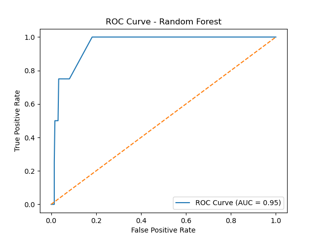

# WFH Employee Burnout Prediction

## 📌 Project Overview

This project analyzes Work-From-Home (WFH) employee behavioral data to predict burnout risk using machine learning models.

The dataset contains work habits such as:
- Work hours
- Screen time
- Sleep hours
- After-hours work
- Meeting count
- Task completion rate

The goal was to identify high burnout risk employees using supervised classification.

---

## 🎯 Problem Statement

Can we predict whether an employee is at high burnout risk based on work behavior patterns?

Since high-risk employees make up only 1% of the dataset, this is a highly imbalanced classification problem.

---

## 🧠 Approach

### 1. Data Cleaning
- Handled missing values
- Encoded categorical variables
- Created target variable: `high_risk` (1 = High burnout, 0 = Not High)

### 2. Feature Engineering
- Created binary classification problem
- Standardized numerical features

### 3. Modeling
- Logistic Regression (Baseline)
- Random Forest Classifier

### 4. Model Evaluation
- Classification Report
- Confusion Matrix
- ROC-AUC Score

Handled severe class imbalance using:
- `class_weight='balanced'`

---

## 📊 Key Results

- ROC-AUC Score: 0.97
- Successfully detected high-risk employees
- Demonstrated impact of class imbalance on model performance


---

## 🛠 Tech Stack

- Python
- Pandas
- NumPy
- Scikit-learn
- Matplotlib

---


## 🚀 How to Run

```bash
pip install -r requirements.txt
jupyter notebook
